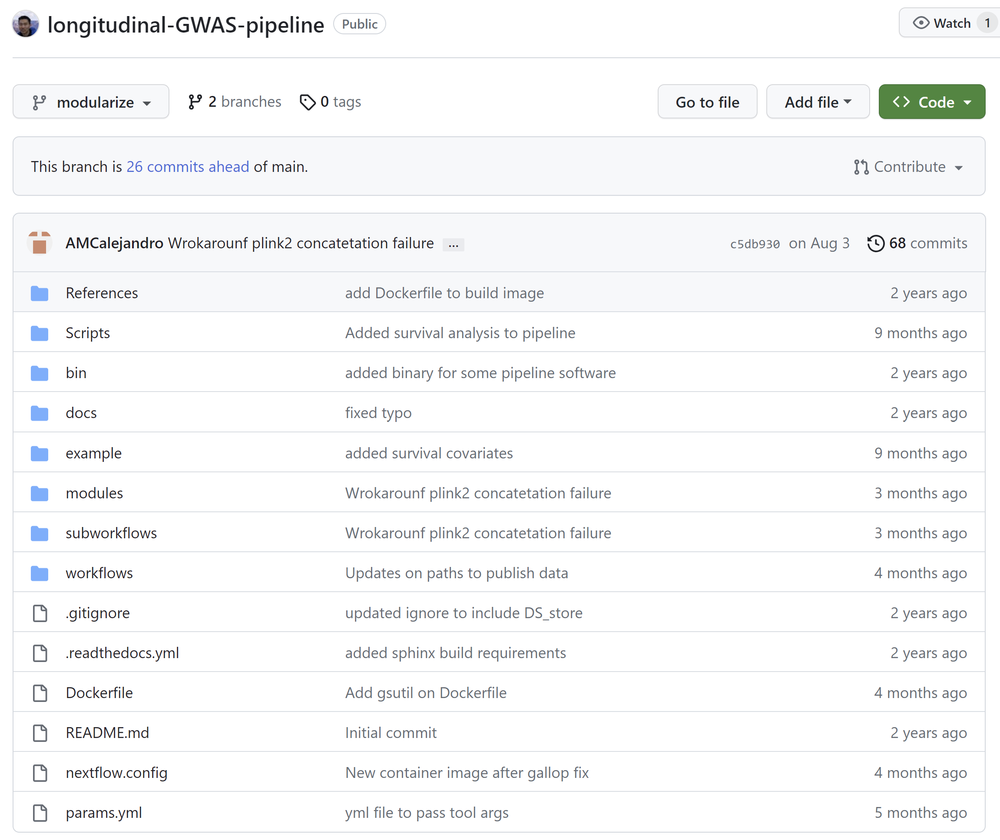
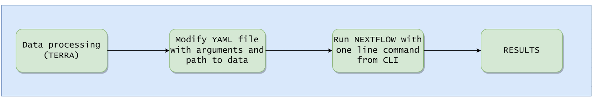

# Worshop pre requisites
Before you can start this workshop, there are a few requisites you should meet to be able to take hands on this workshop.  

1. Have access to Ubuntu Linux distribution:
    - Access to your personal Ubuntu Linux distribution (ie Linux Ubuntu on a VM, Linux Ubuntu on WSL)
    - Access to Ubuntu Linux on a High Computing Cluster (HPC)
    - Access to Ubuntu Linux Virtual Machine in [Terra](https://amp-pd.org/).  

2. **Bash** version must be 3.2 or later in your Linux distribution

3. Java Runtime Environment **JRE** 11 or higher  
    longgwas Nextflow now makes use of the newest DSL2.
    In order to run longgwas workflows, you need to have JRE 11 or higher on your Ubuntu Linux


4. Install [docker](https://docs.docker.com/desktop/install/linux-install/) or [docker desktop](https://www.docker.com/products/docker-desktop/)  

    Nextflow runs the different processes that make up a workflow within docker containers to guarantee all workflow dependencies and versions are specified before hand. This guarantees the tool's portability making reproducibility now at hand.


5. Install [Nextflow](https://www.nextflow.io/docs/latest/getstarted.html)


6. Get [git](https://github.com/git-guides/install-git) installed in Linux Ubuntu
We need to install git so that we can copy the tool from a github remote to our local directory.  
This guarantees

7. Modify /etc/default/grub.
In order to enable Nextflow to manage memory resources within Docker containers, run the following command in your **Bash Shell**

```
GRUB_CMDLINE_LINUX="cgroup_enable=memory swapaccount=1"
```

8. Clone longgwas tool in your working directory

```
git clone --single-branch --branch modularize  git@github.com:michael-ta/longitudinal-GWAS-pipeline.git
```


</br>

# Outline

1. Introduction to Nextflow and longgwas
2. Get familiar with longgwas components
3. longgwas workflow summary
4. Building your first nextflow process
4. Running different longitudinal GWASs using longgwas
5. Summary
<br></br>


# 1. Introduction to Nextflow

To get started, we are going to follow a brief presentation to understand what Nextflow is.  
Then, we will introduce the longgwas tool.
Finally, we will review all longgwas components and capabilities.  


<br></br>

# 2. Get familiar with longgwas components


<br></br>

longgwas is hosted on github remote, and it is where all the development and 


## 2.1 Modules, subworkflows and workflows

longgwas is hosted on github.  
It has three main components everyone should be familiar with:
  - **Modules**: These are the the different processes that all together make a subworkflow
  - **Subworkflow**: They are the combination of different processes from a module or several modules. Based on user inputs, the subworkflow will select which of the available modules to includes.  
  - **Workflow**: A workflow encloses the invocation of one or more processes and operators, that in our case are multiple processes and operators wrapped up in subworkflows

As an example, we could ask ourselves the question of how the GWAS analysis is run within the longgwas workflow after all the QC has been performed.  

**Which are the modules?**
We could look at the content in the [gwasrun module](https://github.com/michael-ta/longitudinal-GWAS-pipeline/blob/modularize/modules/gwasrun/cph.nf). There are three processess definitions, one per nextflow file.  

**Which workflow are the modules included?**
These three modules are included in the [rungwas subworkflow](https://github.com/michael-ta/longitudinal-GWAS-pipeline/blob/modularize/subworkflows/rungwas.nf). Based on user inputs, this subworkflow will allow us to run either of the three main models currently available through longgwas (GLM, CPH, GALLOP-LMM)

**Do we see the GWAS subworkflow in the worjflow?**
Finally, the subworkflow is included in the [main workflow](https://github.com/michael-ta/longitudinal-GWAS-pipeline/blob/modularize/workflows/main.nf) as one step.  


## 2.2 config and yml file

In addition, there are other key components that allow the workflow to run:
  - **.config** file: We use the config file to set up general specifications for each of the executors we have available to run longgwas
  - **.yml** file: We use this file to modify the longgwas arguments so that we can run longgwas based on our needs.


## 2.3 Dockerfile and docker image hosted in the Hub

There is a Dockerfile that contains all software, dependencies and versions longgwas uses to run the main workflow.  
However, it is no longer needed to build the docker image yourself. We are currently hosting the longgwas docker container on the Hub, which means that as long as you have docker installed, when you run longgwas, the tool will automatically pull the image from the Hub


## 2.4 Documentation pages

longgwas has a very [good online documentation resource](https://longitudinal-gwas-pipeline.readthedocs.io/en/latest/parameters.html#ancestry)
It has information on how to run longgwas as a thorough description for all the parameters the tool supports


<br></br>

# 3 Workflow summary



The workflow to run longgwas could be thought in two somewhat simple steps:
  - Terra step. We need to filter the genetic data for the cohorts we want to include. In addition, we also need to process the clinical data so that we generate a covariates file, get our model outcomes, as well as do a bit of data QC if needed.

  - longgwas step. longgwas can be run in two different ways:
    - Using a local executor 
    - Using the google-bactch executor


We won't go through the data preparation step in Terra today as it is out of the scope of this workshop, but I have added an example notebook to quickly see an example. It is available on github so you can download and reuse. [CLICK ME](https://github.com/AMCalejandro/longgwas_workshop/blob/main/materials/LONG-GWAS-PIPELINE.ipynb)


<br></br>

# 4. Building your first nextflow process

We are going to go through three examples running nextflow workflows and getting hands on interacting with some nextflow components
Please, clone the github repository if you have not done so yet.

```
git clone git@github.com:AMCalejandro/longgwas_workshop.git
```


## Example 1

A very easy example to get familiar with process and workflow nextflow keywords.  
This is convenient to familiarise yourself with dataflow. Where does my data go after the process run on the workflow?

## Example 2

This is an example to introduce attendees with channels nextflow structures, and how they are uused coupled with processes.  
We will then try to add an extra process that makes use of the data coming out of the first process

## Example 3

A very complete example provided by the Nextflow training team which is great as you can easily understand all the components part of the nextflow script.  


<br></br>

# 5. Running longitudinal GWASs

Before getting started, please clone the modularize branch of longwas github remote if you have not done so yet.  

```
git clone --single-branch --branch modularize  git@github.com:michael-ta/longitudinal-GWAS-pipeline.git
```
Now that we have seen some basic examples running nextflow, we are going to try to run our very first job with longgwas.
To do so, we are going to through the following steps together.  
  - Define arguments and data paths on the yml file
  - Choose one of the executors available on the config file
  - Run longgwas with one simple comand 


# 5.1 Run longgwas analysis 

Once we have applied all the changes on the yml file, we can run with a local executor.
We are going to apply several changes so that:
- We modify the filtering parameters based on our needs
- We specify to run either GLM, CPH, or GALLOP-LMM
- We define well the input data to the tool

Tu run the analysis we will repeteadly use the follow comand

```
nxtflow run workflows/main.nf \
  -params-file params.yml \
  --profile standard
```


